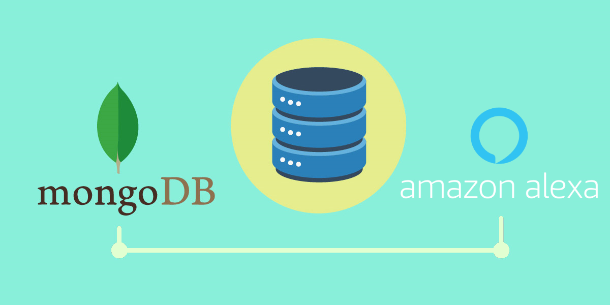

[](https://codecov.io/gh/xavidop/ask-sdk-mongodb-persistence-adapter)

[](https://npmjs.org/package/ask-sdk-mongodb-persistence-adapter)
[](https://npmjs.org/package/ask-sdk-mongodb-persistence-adapter)
[](https://npmjs.org/package/ask-sdk-mongodb-persistence-adapter)

[](https://ask-sdk-mongodb-persistence-adapter.netlify.app/)
[](https://github.com/xavidop/ask-sdk-mongodb-persistence-adapter/issues)

ASK SDK MongoDB Persistence Adapter package contains implementation of persistence adapter in Core SDK ('ask-sdk-core') based on AWS SDK.




## What is ASK SDK MongoDB Persistence Adapter

The ASK SDK v2 for Node.js is an open-source Alexa CustomSkill Development Kit. ASK SDK v2 for Node.js makes it easier for you to build highly engaging skills, by allowing you to spend more time on implementing features and less on writing boiler-plate code. 

## Installing
ASK SDK MongoDB Persistence Adapter package is an addon package for the core SDK ('ask-sdk-core') and thus has peer dependency of the core SDK package. From within your NPM project, run the following commands in the terminal to install them:

```
npm install --save ask-sdk-mongodb-persistence-adapter
```

## Usage and Getting Started

You can find all the documentation [here](https://ask-sdk-mongodb-persistence-adapter.netlify.app/).

How to create a instance of `MongoDBPersistenceAdapter` and `PartitionKeyGenerator`:

1. Passing the MongoDB URL connection as a parameter:

```javascript
let { MongoDBPersistenceAdapter, PartitionKeyGenerators } = require('ask-sdk-mongodb-persistence-adapter');


let options = {
  databaseName: 'myDb',
  collectionName: 'myCollection',
  mongoURI: 'mongodb+srv://<username>:<password>@<cluster>.mongodb.net/',
  partitionKeyGenerator: (requestEnvelope) => {
    return PartitionKeyGenerators.userId(requestEnvelope);
  },
};

let adapter =  new MongoDBPersistenceAdapter(options);
```

2. Passing [MongoClient](https://mongodb.github.io/node-mongodb-native/3.6/api/MongoClient.html) as a parameter. Using this, you have to add [`mongodb` npm package](https://www.npmjs.com/package/mongodb):

```javascript
let { MongoDBPersistenceAdapter, PartitionKeyGenerators } = require('ask-sdk-mongodb-persistence-adapter');
let { MongoClient } = require('mongodb');

let mongoClient = new MongoClient('mongodb+srv://<username>:<password>@<cluster>.mongodb.net/')

let options = {
  databaseName: 'myDb',
  collectionName: 'myCollection',
  mongoDBClient: mongoClient,
  partitionKeyGenerator: (requestEnvelope) => {
    return PartitionKeyGenerators.userId(requestEnvelope);
  },
}

let adapter =  new MongoDBPersistenceAdapter(options);

```

finally we have to add this new adapter to the `SkillBuilders` object with the method `withPersistenceAdapter`:


```javascript

exports.handler = Alexa.SkillBuilders.custom()
    .addRequestHandlers(
        LaunchRequestHandler,
        HelloWorldIntentHandler,
        HelpIntentHandler,
        CancelAndStopIntentHandler,
        FallbackIntentHandler,
        SessionEndedRequestHandler,
        IntentReflectorHandler)
    .addErrorHandlers(
        ErrorHandler)
    .withPersistenceAdapter(adapter)
    .lambda();
```

Check the `MongoDBPersistenceAdapter` full specification [here](https://ask-sdk-mongodb-persistence-adapter.netlify.app/classes/_mongodbpersistenceadapter_.mongodbpersistenceadapter.html#constructor).

Check the `PartitionKeyGenerator` full specification [here](https://ask-sdk-mongodb-persistence-adapter.netlify.app/modules/_partitionkeygenerators_.html#partitionkeygenerator).


## Usage with TypeScript
The ASK SDK MongoDB Persistence Adapter package for Node.js bundles TypeScript definition files for use in TypeScript projects and to support tools that can read .d.ts files. Our goal is to keep these TypeScript definition files updated with each release for any public api.

### Pre-requisites
Before you can begin using these TypeScript definitions with your project, you need to make sure your project meets a few of these requirements:
- Use TypeScript v2.x
- Includes the TypeScript definitions for node. You can use npm to install this by typing the following into a terminal window:

```
npm install --save-dev @types/node
```

### In Node.js
To use the TypeScript definition files within a Node.js project, simply import ask-sdk-mongodb-persistence-adapter as below:

In a TypeScript file:

```typescript
import * as Adapter from 'ask-sdk-mongodb-persistence-adapter';
```

In a JavaScript file:

```javascript
const Adapter = require('ask-sdk-mongodb-persistence-adapter');
```

## Opening Issues
For bug reports, feature requests and questions, we would like to hear about it. Search the [existing issues](https://github.com/xavidop/ask-sdk-mongodb-persistence-adapter/issues) and try to make sure your problem doesn’t already exist before opening a new issue. It’s helpful if you include the version of the SDK, Node.js or browser environment and OS you’re using. Please include a stack trace and reduced repro case when appropriate, too. 

## License
This Adapter is distributed under the Apache License, Version 2.0, see LICENSE for more information.
